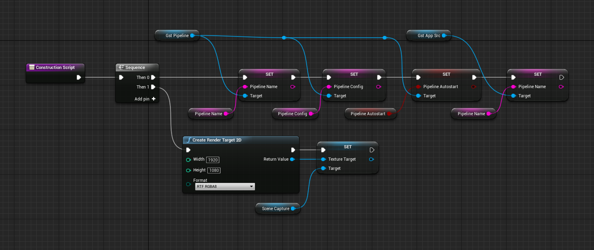
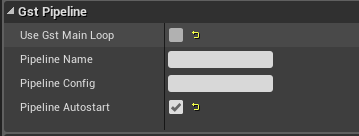
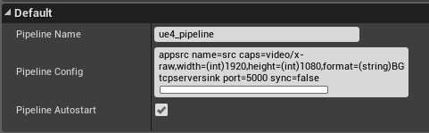

# Setup

Engine:
--------
- To use this plugin first `Clone` this repository in the `Plugins/Simbotic` directory of your  Engine:

```
git clone git@github.com:Simbotic/ue4-gst-plugin.git
```
- After clone the repository, recompile the engine using `make` .

Project:
--------

- To use the plugin on a project, update your `.uproject` adding the `UE4 Gstreamer Plugin` as an additional dependency on `.uproject`:

```
...,
"Modules": [
	{
		"Name": "GST_Test",
		"Type": "Runtime",
		"LoadingPhase": "Default",
		"AdditionalDependencies": [
			"Engine"
		]
	}
],
"Plugins": [
	{
		"Name": "GStreamer",
		"Enabled": true
	},
],
...

```
- Add, in the constructors of the classes of your project: `Source/PROJECT_NAME.Target.cs` and `Source/PROJECT_NAMEEditor.Target.cs` the following:
```
bUseUnityBuild = false;
bUsePCHFiles = false;
```

# Usage

Blueprints:



GstAppSrc component:  


GstPipeline component: 
 


Details panel:

