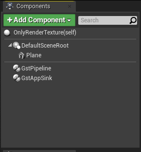
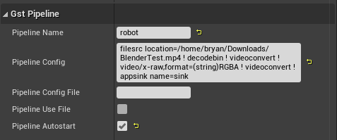
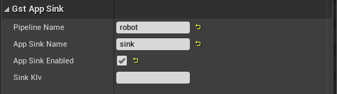
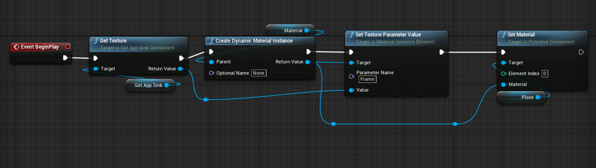
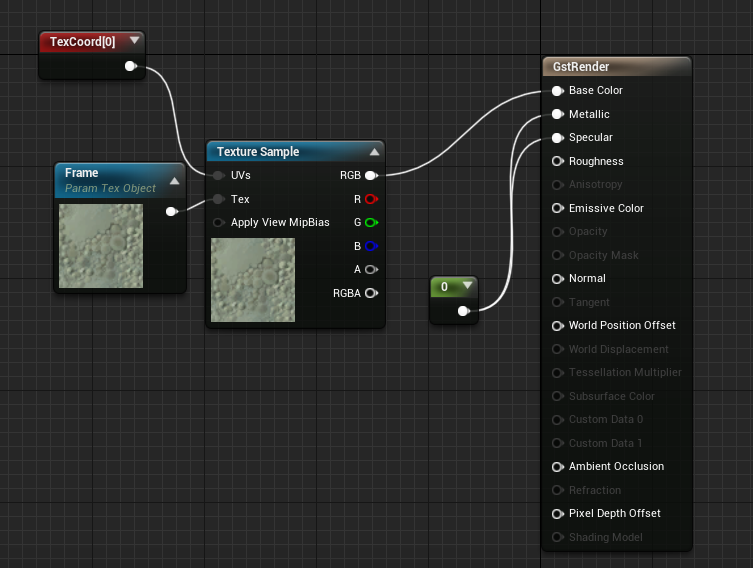
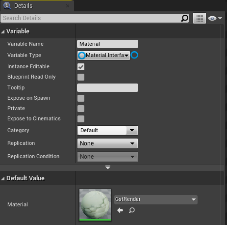
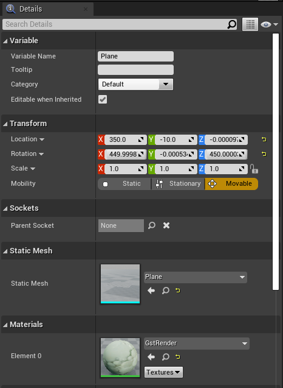

# Setup

Engine:
--------
- To use this plugin first `Clone` this repository in the `Plugins/Simbotic` directory of your  Engine:

```
git clone git@github.com:Simbotic/Streamer.git
```
- After clone the repository, recompile the engine using `make` .

Project:
--------

- To use the plugin on a project, update your `.uproject` adding the `UE4 Gstreamer Plugin` as an additional dependency on `.uproject`:

```
...,
"Modules": [
	{
		"Name": "GST_Test",
		"Type": "Runtime",
		"LoadingPhase": "Default",
		"AdditionalDependencies": [
			"Engine"
		]
	}
],
"Plugins": [
	{
		"Name": "GStreamer",
		"Enabled": true
	},
],
...

```
- Add, in the constructors of the classes of your project: `Source/PROJECT_NAME.Target.cs` and `Source/PROJECT_NAMEEditor.Target.cs` the following:
```
bUseUnityBuild = false;
bUsePCHFiles = false;
```

# Usage

On Blueprints the Blueprint hierarchy you need:

* `GstPipeline`.
* 2 `GstAppSrc` these components will be named as `GstAppSrcRGB` and `GstAppSrcDepth`.
* 2 `scene Capture Component 2D` these components will be named as `SceneCaptureRGB` and `SceneCaptureDepth`.


# GstPipeline #


*  `Pipeline Name` will be set as **robot** 
* **Pipeline config** will set as:

	> ``` appsrc name=sensor_rgb caps=video/x-raw,width=512,height=512,format=BGRx, framerate=10/1 ! videoconvert ! queue2 ! fpsdisplaysink ```
* **Pipeline Config File** will be empty.
* **Pipeline Use File** will be unchecked.
* **Pipeline Autostart** will be checked.


# GstAppSrc #

The components `GstAppSrc` are named as `GstAppSrcRGB` and `GstAppSrcDepth` these components are related with `Scene Capture Components` 


*  **Pipeline Name** will be set as **robot**. 
* **App Src Name** it will be set as `sensor_rgb` and `sensor_depth` respectively.
* **App Src Enabled** will be set as **checked.** 
* **Src Video** it will be set as **SceneCaptureRGB** and **SceneCaptureDepth.**
* **Src Klv** Will Set as empty.


# Scene Capture Component 2D (General).

on Scene Capture component go to `Post Process Volume/Rendering/Features/Post process Materials/Array` 


## Materials.
>
>


 create a new array, on `choose` select  `asset reference`, then add the respectively Material `M_SensorBGRA` and `M_SensorDepth`.

 # Scene Capture Component 2D (RGB).

 Modify tab `Scene Capture`

 

 * On **Primitive Render Mode** select ` Render Scene Primitives` 
 * On **Capture Source** select ` Final Color (LDR) in RGB` 


# Scene Capture Component 2D (Depth).
 Modify tab `Scene Capture`


 
 * On **Capture Source** select ` Final Color (LDR) in RGB` 

# Render a local file on a mesh.
 We will build a `BP` were we will add the following components.

* GstPipeline
* GstAppSink
* Plane (mesh)

 


## GstPipeline.
 
 We need to add the name and the config to the pipeline.

 

### pipeline name. 
> `robot`

### pipeline config.

 >``` filesrc location=/Absolute/Path/To/Your/File.mp4 ! decodebin ! videoconvert ! video/x-raw,format=(string)RGBA ! videoconvert ! appsink name=sink ```

 
## GstAppSink.

We need to add  the pipeline name that we defined before `robot` and the appsink that is set at the end of the pipeline config, it's called `sink`

 

## Blueprint Event Graph.

 We need to add a variable, it type will be `Material Interface`, we will name it as `Material`
 
 We will drag the GstAppSink component to the event Graph, from it pin we will generate a Get Texture Module, then using the variable we created before, generate a module type `Create Dynamic Material Instance`, Finally drag the `Plane` from BP components that we created at the begin, we will set a material on the plane.


 


## Create Material To Render The Local File.

Create a material (we will name it as (`GstRender`), inside of it, create a `Texture Sample` plug in the Base color, then add a `Texture Object` an convert it on a parameter, connect this parameter to the Texture input of the Texture Sample, Create A Texture Coordinate and plug in the UVs input, finally, create a constant it's value will be 0, plug in metallic and specular inputs.

 


## Final step.

Return to the BP that we create at the begin, and set Variable `Material` and the plane material, with the material  we created.

### Material

 

 ### Plane

 

